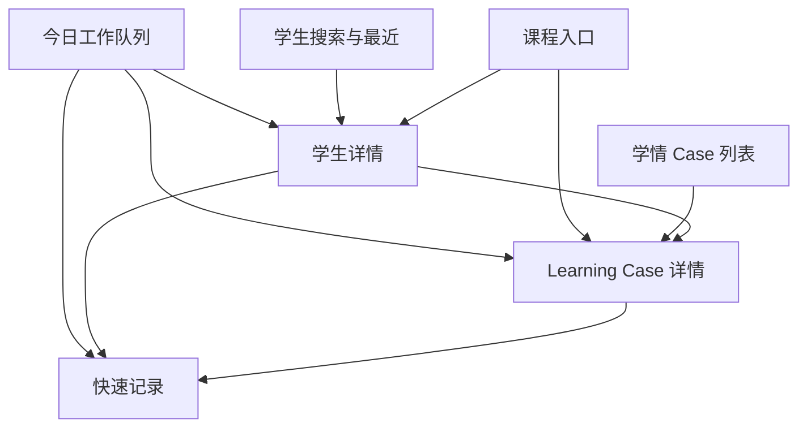

# Xueqing Information Architecture

状态：Phase 0A.5 foundation baseline

最后更新：2026-09-02

本文件定义“信息放在哪里、为什么先看到、如何进入下一个上下文”。它不定义颜色和精确组件样式；视觉 token 见 `VISUAL_FOUNDATION.md`，实现细节见 `COMPONENTS.md`。

## 1. 工作对象与关系

Xueqing 的最小工作对象如下：

| 对象 | 教师要回答的问题 | 默认展示方式 | 不应被替代为 |
| --- | --- | --- | --- |
| Student | 我正在帮助谁，学科上下文是什么？ | 学生行、学生详情首屏 | 一长串档案字段 |
| Subject Profile | 在哪个学科/教学上下文中理解问题？ | 学生详情和 Case 上下文 | 全局筛选标签 |
| Learning Case | 当前最重要的问题是什么，进展到哪一步？ | Case 行、Case 详情叙事 | 统计卡或工单编号 |
| Evidence | 我看到了什么，凭什么这样判断？ | Case 的独立证据段/时间线事件 | 教师判断 |
| Intervention | 教师实际做了什么或准备做什么？ | Case 的动作段 | 泛化建议 |
| Assessment / Verification | 这次检查结果是什么，是否还需要老师确认？ | Case 评估段 + pending verification | 自动 stable |
| Case Action | 下一次具体要完成什么、何时做？ | Today action 行、Case action 段 | Case status |
| Lesson | 哪次课承载了这些动作和观察？ | 课程入口、学生/Case 关联 | 排课收费系统 |

## 2. 一级导航

一级导航固定为四个工作入口，保持浅层结构：

| 入口 | 核心任务 | 首要内容 | 不承载 |
| --- | --- | --- | --- |
| 今日 | 今天先做什么 | due、overdue、pending verification、undated、最近学生、进入课堂 | KPI、图表、总分 |
| 学生 | 找到并理解一个学生 | 搜索、最近学生、学科上下文、当前重点 | 全量历史默认展开 |
| 课程 | 从一次教学进入记录 | 最近/今天的 lesson entry、学生与动作 | 排课、考勤、收费 |
| 学情 | 找到需要复盘的 Case | Case 列表、筛选、状态与待验证 | 大数据 dashboard、伪风险 |

详情不是一级导航：`Today → Student Detail → Learning Case` 是主工作路径；从课程也可以进入学生或 Case。Quick Capture 是上下文动作，不在一级导航中占一个永久位置。

## 3. 信息架构图

## 4. 页面层级与返回规则

### 4.1 Today

Today 的列表项可以直接完成一个明确的 Case Action；点击标题/学生名进入详情。完成 action 后保留当前位置并更新该学生簇，不把教师送回顶部。

### 4.2 Student Detail

Student Detail 的首屏是“当前工作摘要 + 可继续深入的 Case”。返回回到来源列表并恢复滚动位置；从 Today 进入时优先回 Today，从学生搜索进入时回学生搜索。

### 4.3 Learning Case

Case 详情的首屏固定显示当前 Case status 和 primary Next Action。Evidence、教师判断、Intervention、Assessment/Verification 分段显示；timeline 放在当前工作内容之后。返回保持来源上下文。

### 4.4 Quick Capture

Quick Capture 是短暂任务层：

- Android compact：bottom sheet 或全屏 sheet；返回先收键盘，再关闭；脏内容关闭前确认。
- Windows medium/expanded：dialog 或右侧 panel；不离开底层上下文；Esc 在无改动时关闭，有改动时确认。
- 保存成功后默认关闭并回到原上下文；可提供“继续记录”和“查看学生”，不自动强迫进入 formalize 表单。

## 5. Today 的去重与排序

Today 使用单一工作队列，不为同一事件生成多个视觉副本。排序和合并规则：

1. 已逾期 action：按逾期严重性/日期排序，明确写“已逾期”。
2. 今天到期 action：按今天的时间或教师配置的顺序排序，写“今天到期”。
3. 待验证：Case 已有检查结果但仍等待教师确认；写“待验证”，不改写成“逾期”。
4. 待安排：没有 due date 的 pending primary action，写“待安排”，置于有日期事项之后，但永不隐藏。
5. 最近学生：只做发现入口，不制造额外 action。

同一学生的 action 形成一个视觉簇：学生姓名只出现一次；簇内最多展示三条主要事项，其余显示“还有 N 项”。待验证如果正好是该学生的主要事项，留在簇内，不再在页面另一处复制；如果全局待验证需要跨学生扫视，可由同一数据视图提供分组切换，而不是重复实体。

## 6. Student Detail 的首屏优先级

首屏按以下顺序稳定排列：

1. 身份最小上下文：姓名、年级/学科、教师可见范围；不显示不必要联系方式。
2. “现在最重要的三件事”：每项必须指向 Case 或 action，并有明确下一步。
3. 当前 Learning Cases：状态、问题标题、最近关键事实、primary action。
4. 待验证：结果与待确认动作分开表达。
5. 最近关键事实：最近 Evidence / Lesson / Intervention 的少量摘要。
6. 学科上下文：只展示理解当前 Case 必需的内容。
7. 更早历史：折叠或 timeline，按需展开。

“三件事”是首屏认知上限，不是新的业务字段或评分。若只有一件事，就只展示一件；若没有 Case，显示清楚的空状态和“记录问题”入口。

## 7. Case 详情的信息关系

Case 详情需要同时让教师“做下一步”和“解释为什么”。当前工作区顺序：

1. Case title + student/subject + Case status + priority。
2. Next Action（主操作、负责人、due/待安排）。
3. 问题定义（当前问题是什么）。
4. 最近 Evidence（看到了什么）。
5. 教师判断（如何理解）。
6. Intervention（做了什么）。
7. Assessment / Verification（本次检查结果；待确认则明确待验证）。
8. timeline（从创建、补充、干预、检查、状态变化到 reopen 的历史）。

不同段落可以逐步补充，不能因为某一段为空而把 Case 伪装成“无问题”或自动跳过语义。空段使用“尚未记录”并提供合适的补充动作。

## 8. 入口与退出矩阵

| 来源 | 点击 | 目标 | 返回后保持 |
| --- | --- | --- | --- |
| Today action | 完成 | 当前 action 更新 | Today 原学生簇与滚动位置 |
| Today student | 学生名 | Student Detail | Today |
| Student current case | Case 标题 | Case Detail | Student Detail |
| Student header | 记录问题 | Quick Capture | Student Detail |
| Case primary action | 开始/完成 | action sheet 或轻量编辑 | Case Detail |
| 学生搜索结果 | 行 | Student Detail | 搜索结果与查询 |
| 学情 Case 行 | 行 | Case Detail | Case 列表筛选条件 |
| 课程入口 | 学生/问题 | Student 或 Case | 课程入口 |

## 9. 权限与隐私可见性

权限不是一个静默过滤器。页面应在不泄露额外数据的前提下表达边界：

- 无权查看：不展示学生细节，只显示“当前账号无权查看此内容”。
- 可查看、不可编辑：展示摘要和锁定说明，“你可以查看，但不能修改此学科内容”。
- 可编辑但不能完成特定动作：显示可用动作，禁用动作旁说明所需权限。
- 学生联系方式等非当前任务信息不在首屏主动展开。

真实权限、RLS、会话和加密 draft 仍属于后续工程阶段；prototype 只验证可见性文案和布局不崩。

## 10. 响应式信息关系

同一信息关系在不同窗口的组织方式：

| 可用宽度 | 导航 | Today | Student Detail | Case Detail |
| --- | --- | --- | --- | --- |
| `<600` | AppBar + bottom navigation | 单列学生簇；操作优先 | 单列、首屏三件事置顶 | 单列叙事；primary action 固定在上下文顶部 |
| `600–1023` | compact rail | 内容区单列或窄双列 | 单列为主，最近事实可放尾部 | 单列，编辑用 dialog/sheet |
| `≥1024` | expanded rail | 主列表 + 适度侧栏/筛选 | 工作主列 + 最近事实侧栏 | 叙事主列 + action/metadata 侧栏；内容限宽 |

宽屏只增加并列理解，不增加新的业务字段；窄屏只改变顺序和入口，不删除 Next Action、状态或失败信息。

## 11. Excel 原型到 IA 的边界

Excel 原型的“学生档案、初诊问题、知识闭环、周度跟进、顽固问题”不是五个一级导航。它们分别落入 Student、Learning Case、Evidence/Intervention/Assessment、Case Action 和 timeline 的不同语义位置。家校沟通与阶段复盘在 Phase 0A.5 只保留未来入口边界，不扩展为当前主流程。
